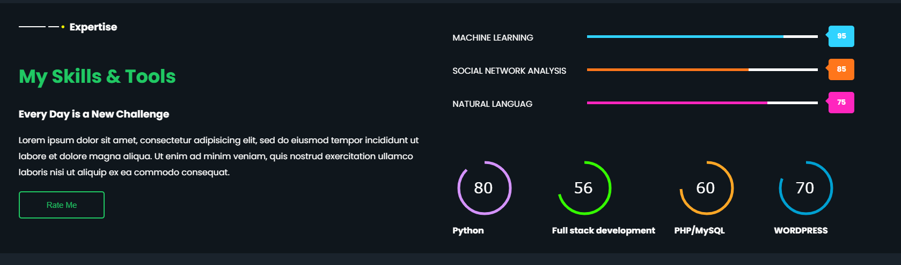
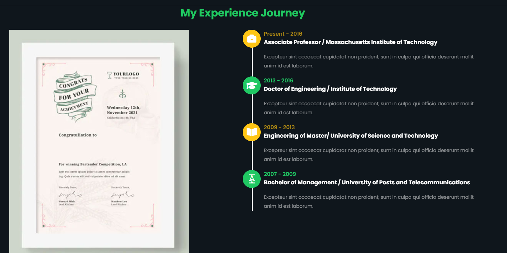

# Teacher-s-portfolio

Simple Gift For My Teacher's. Website made with Html Css and Js. 

Make a teacher's portfolio Website with Html CSS and js.  It is very important to make an E-website For Showing Your Skills, For this, You need a Portfolio website, 
In this Video Tutorial, We are Going to Preview a Portfolio website That is Specially designed For Teachers. It is Fully Responsive 

[Live Demo](https://naemazam.github.io/Teacher-portfolio)
[Youtube Video](https://www.youtube.com/watch?v=7AXtl8_1V4o&t=5s)

# screenshots 

# Free To Use 
